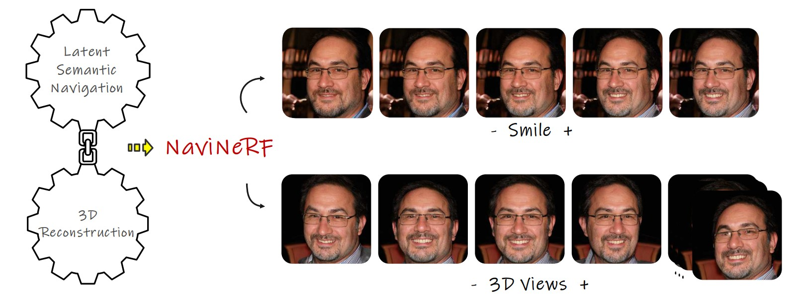
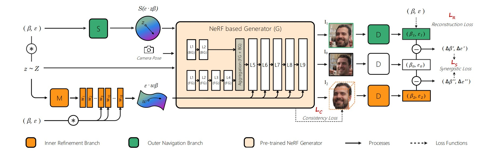
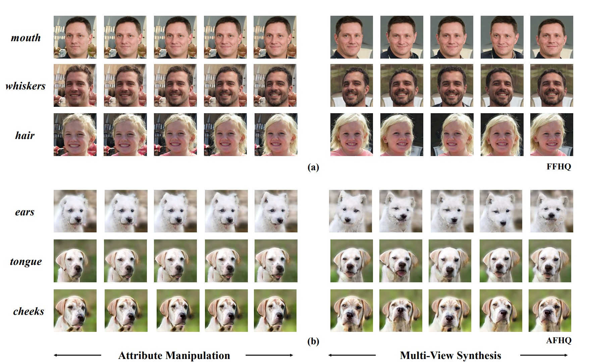

# NaviNeRF: NeRF-based 3D Representation Disentanglement by Latent Semantic Navigation</sub>




**NaviNeRF: NeRF-based 3D Representation Disentanglement by Latent Semantic Navigation**<br>
Baao Xie, Bohan Li, Zequn Zhang, Junting Dong, Xin Jin, Jingyu Yang, Wenjun Zeng<br>




### [Project Page](https://github.com/Arlo0o/NaviNeRF/tree/master) | [Arxiv](https://arxiv.org/pdf/2304.11342.pdf)

Abstract: *3D representation disentanglement aims to identify, decompose, and manipulate the underlying explanatory factors of 3D data, which helps AI fundamentally understand our 3D world. This task is currently under-explored and poses great challenges: (i) the 3D representations are complex and in general contains much more information than 2D image; (ii) many 3D representations are not well suited for gradient-based optimization, let alone disentanglement. To address these challenges, we use NeRF as a differentiable 3D representation, and introduce a self-supervised Navigation to identify interpretable semantic directions in the latent space. To our best knowledge, this novel method, dubbed NaviNeRF, is the first work to achieve fine-grained 3D disentanglement without any priors or supervisions. Specifically, NaviNeRF is built upon the generative NeRF pipeline, and equipped with an Outer Navigation Branch and an Inner Refinement Branch. They are complementary -- the outer navigation is to identify global-view semantic directions, and the inner refinement dedicates to fine-grained attributes. A synergistic loss is further devised to coordinate two branches. Extensive experiments demonstrate that NaviNeRF has a superior fine-grained 3D disentanglement ability than the previous 3D-aware models. Its performance is also comparable to editing-oriented models relying on semantic or geometry priors.*

## Requirements
The codebase is tested on 
* Python 3.7
* PyTorch 1.7.1
 

For additional python libraries, please install by:

```
pip install -r requirements.txt
```
 


## Train a new NaviNeRF model

Here is a simple example of NaviNeRF run command
```bash
python run_train.py gan_type=nerfgan deformator=ortho outdir=${OUTDIR} seed=${seed} 
```
You can download Stylenerf pre-train model from [Hugging Face 🤗](https://huggingface.co/facebook/stylenerf-ffhq-config-basic/blob/main/ffhq_256.pkl). The script will save the latent space directions and images charts with latent directions. Please check more arguments of parameters in `trainer.py`.

## Evaluation

Run `evaluation.py` for NaviNeRF evaluation.
 

## Results

Here are some Fine-grained 3D Disentanglement Results of NaviNeRF:


```
@misc{xie2023navinerf,
      title={NaviNeRF: NeRF-based 3D Representation Disentanglement by Latent Semantic Navigation}, 
      author={Baao Xie and Bohan Li and Zequn Zhang and Junting Dong and Xin Jin and Jingyu Yang and Wenjun Zeng},
      year={2023},
      eprint={2304.11342},
      archivePrefix={arXiv},
      primaryClass={cs.CV}
}
```
## Credits
Stylenerf code and weights are based on the authors implementation:
https://github.com/facebookresearch/StyleNeRF/tree/main


 
 

